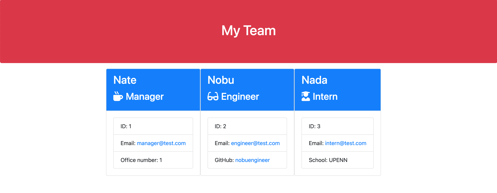

# Team Member Profile Generator

 

  ## Table-of-Contents

  * [Description](#description)
  * [Installation](#installation)
  * [Usage](#usage)
  * [Mockup](#mockup)
  * [Questions](#questions)

  ## Description

  What kept me motivated for this project was my curiousity on test development & classes. I needed to apply what I've learned to a project that needed both. This project was the perfect "sandbox" for me to practice both skils. It helped me get a better understanding of both, even though at this time, I feel that they are still very basic code. We all start from somewhere and I plan to learn even more from here!

  I built this project to test myself. Daily, I try to practice coding and hone on my skills. 

  This project solves any team that would love to put together a small website together to keep information for their team! 

  I learned a ton, test driven development & OOP had me confused for a long time. I spent a ton of time looking at my screen not knowing where to start but eventually I was able to put the pieces together and build this project that gave me a better understanding on JavaScript, Node & all things in between.

  ## Installation

  Clone the repo, then make sure you "npm i" to install the needed packages.

  ## Usage

  Once you've done the above instructions, open your terminal in the root directory & run "node index.js" and follow the prompts to build your custom team profile! 

  ## Mockup 

  

  ## Questions

  Please contact me using the following links:

  [GitHub](https://github.com/natesoum)

  [Email: nathunsoum@gmail.com](mailto:nathunsoum@gmail.com)
